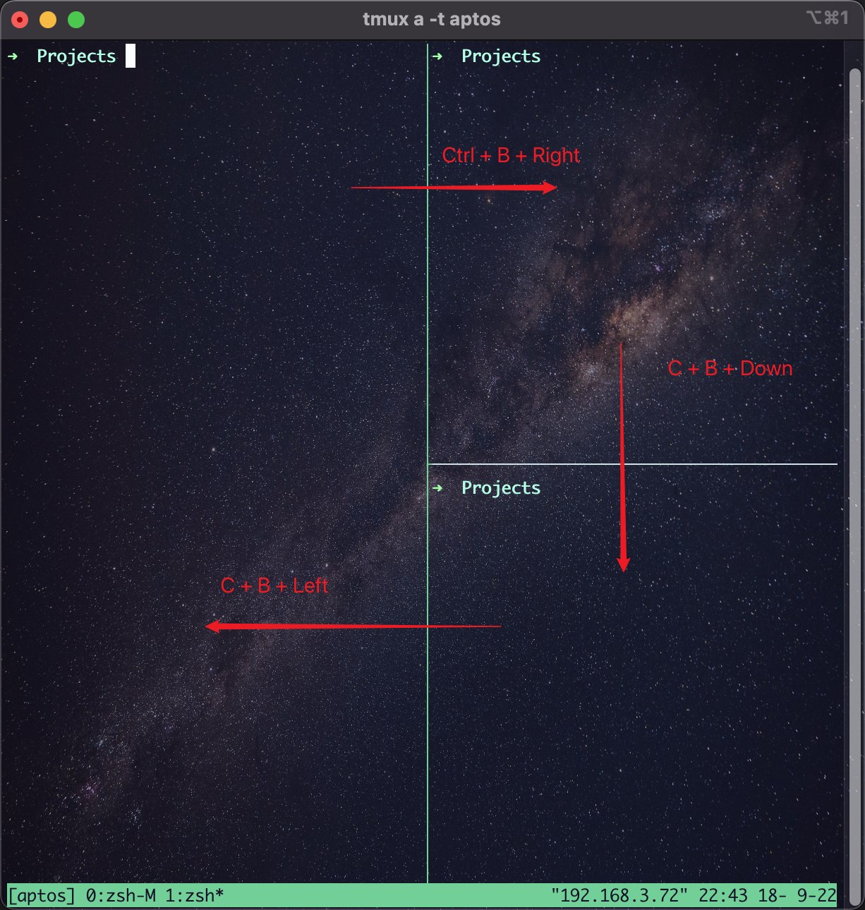

# Tmux

> tmux is a program which runs in a terminal and allows multiple other terminal programs to be run inside it. Each program inside tmux gets its own terminal managed by tmux, which can be accessed from the single terminal where tmux is running - this called multiplexing and tmux is a terminal multiplexer.

## Install tmux

```bash
# install from brew
brew install tmux
# veriy tmux is installed
tmux --help
```

## Commonly used commands

### New a session

```bash
tmux new -s my-website
```

### Detach current session

```bash
tmux detach
```

### Re-enter the session

```bash
# enter the first session
tmux a
# enter the session "my-website"
tmux a -t my-website
```

`a` is short for the `attach-session`.

### List all the sessions

```bash
tmux ls
```

Kill session

```bash
# close the session 
tmux kill-session -t my-website
```

Kill server

```bash
# all the sessions will be closed
tmux kill-server
```

## Hot Keys

`Ctrl + b` is the prefix key of tmux, **any hot keys are required the prefix key to be pressed first.**

Tmux provides a lot of hot keys, you can press `Ctrl + b` + `?` to view all the hot keys.

## Manage Panes

Sometimes we want to use multiple terminal windows under one project, such as serve the website and run unit tests.
Although we can open multiple tabs, but it will distract us when switching between tabs.

We can manage multiple panes in one tab with the help of tmux's `split-window` command

```bash
# split a vertical pane
tmux split-window
# split a horizontal pane
tmux split-window -h
```

Or you can use the hot keys to split a window to panes

- `Ctrl + b` + `%`: splits the current pane into two horizontally, producing two panes next to each other, one on the left and one on the right.
- `Ctrl + b` + `"`: splits the current pane into two vertically, producing two panes one above the other.

For example, we run the above commands to split into 3 panes.



To switch between the panes, you can press the prefix key `Ctrl + b` , then press the arrow keys.

- `Ctrl + b` + Right: Switch to the top right pane
- `Ctrl + b` + Down: Switch to the bottom right pane
- `Ctrl + b` + Left: Switch back to the first left pane

## Reference

[Wiki Getting-Started](https://github.com/tmux/tmux/wiki/Getting-Started)
